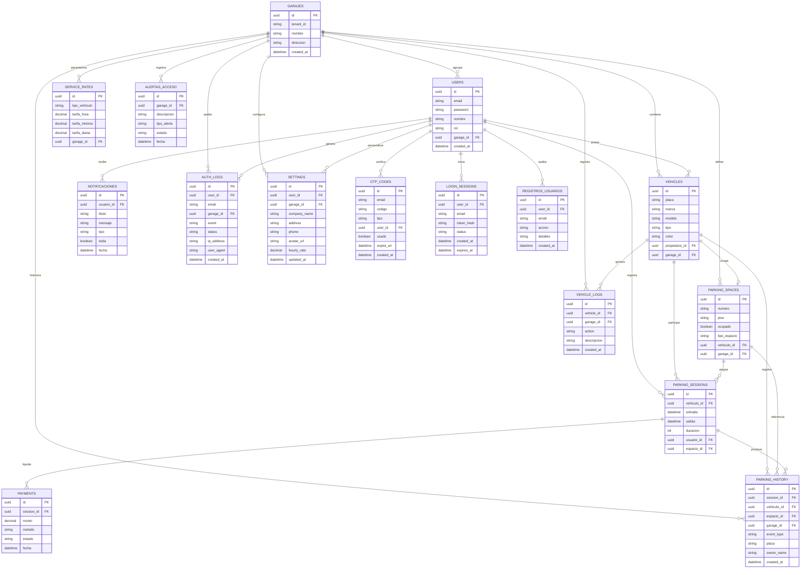

# Diagrama ER de Base de Datos - SmartPark

```mermaid
erDiagram
    GARAJES {
        uuid id PK
        string tenant_id
        string nombre
        string direccion
        datetime created_at
    }

    USERS {
        uuid id PK
        string email
        string password
        string nombre
        string rol
        uuid garage_id FK
        datetime created_at
    }

    VEHICLES {
        uuid id PK
        string placa
        string marca
        string modelo
        string tipo
        string color
        uuid propietario_id FK
        uuid garage_id FK
    }

    PARKING_SPACES {
        uuid id PK
        string numero
        string piso
        boolean ocupado
        string tipo_espacio
        uuid vehiculo_id FK
        uuid garage_id FK
    }

    PARKING_SESSIONS {
        uuid id PK
        uuid vehiculo_id FK
        datetime entrada
        datetime salida
        int duracion
        uuid usuario_id FK
        uuid espacio_id FK
    }

    PARKING_HISTORY {
        uuid id PK
        uuid session_id FK
        uuid vehiculo_id FK
        uuid espacio_id FK
        uuid garage_id FK
        string event_type
        string placa
        string owner_name
        datetime created_at
    }

    PAYMENTS {
        uuid id PK
        uuid session_id FK
        decimal monto
        string metodo
        string estado
        datetime fecha
    }

    SERVICE_RATES {
        uuid id PK
        string tipo_vehiculo
        decimal tarifa_hora
        decimal tarifa_minima
        decimal tarifa_diaria
        uuid garage_id FK
    }

    NOTIFICACIONES {
        uuid id PK
        uuid usuario_id FK
        string titulo
        string mensaje
        string tipo
        boolean leida
        datetime fecha
    }

    ALERTAS_ACCESO {
        uuid id PK
        uuid garage_id FK
        string descripcion
        string tipo_alerta
        string estado
        datetime fecha
    }

    AUTH_LOGS {
        uuid id PK
        uuid user_id FK
        string email
        uuid garage_id FK
        string event
        string status
        string ip_address
        string user_agent
        datetime created_at
    }

    SETTINGS {
        uuid id PK
        uuid user_id FK
        uuid garage_id FK
        string company_name
        string address
        string phone
        string avatar_url
        decimal hourly_rate
        datetime updated_at
    }

    VEHICLE_LOGS {
        uuid id PK
        uuid vehicle_id FK
        uuid garage_id FK
        string action
        string descripcion
        datetime created_at
    }

    OTP_CODES {
        uuid id PK
        string email
        string codigo
        string tipo
        uuid user_id FK
        boolean usado
        datetime expira_en
        datetime created_at
    }

    LOGIN_SESSIONS {
        uuid id PK
        uuid user_id FK
        string email
        string token_hash
        string status
        datetime created_at
        datetime expires_at
    }

    REGISTROS_USUARIOS {
        uuid id PK
        uuid user_id FK
        string email
        string accion
        string detalles
        datetime created_at
    }

    GARAJES ||--o{ USERS : agrupa
    GARAJES ||--o{ VEHICLES : contiene
    GARAJES ||--o{ PARKING_SPACES : define
    GARAJES ||--o{ SERVICE_RATES : parametriza
    GARAJES ||--o{ ALERTAS_ACCESO : registra
    GARAJES ||--o{ AUTH_LOGS : audita
    GARAJES ||--o{ SETTINGS : configura
    GARAJES ||--o{ VEHICLE_LOGS : registra
    GARAJES ||--o{ PARKING_HISTORY : historiza

    USERS ||--o{ VEHICLES : posee
    USERS ||--o{ PARKING_SESSIONS : registra
    USERS ||--o{ NOTIFICACIONES : recibe
    USERS ||--o{ AUTH_LOGS : genera
    USERS ||--o{ SETTINGS : personaliza
    USERS ||--o{ OTP_CODES : verifica
    USERS ||--o{ LOGIN_SESSIONS : inicia
    USERS ||--o{ REGISTROS_USUARIOS : audita

    VEHICLES ||--o{ PARKING_SESSIONS : participa
    VEHICLES ||--o| PARKING_SPACES : ocupa
    VEHICLES ||--o{ VEHICLE_LOGS : genera
    VEHICLES ||--o{ PARKING_HISTORY : registra

    PARKING_SPACES ||--o{ PARKING_SESSIONS : asigna
    PARKING_SPACES ||--o{ PARKING_HISTORY : referencia

    PARKING_SESSIONS ||--o{ PAYMENTS : liquida
    PARKING_SESSIONS ||--o{ PARKING_HISTORY : produce
```
