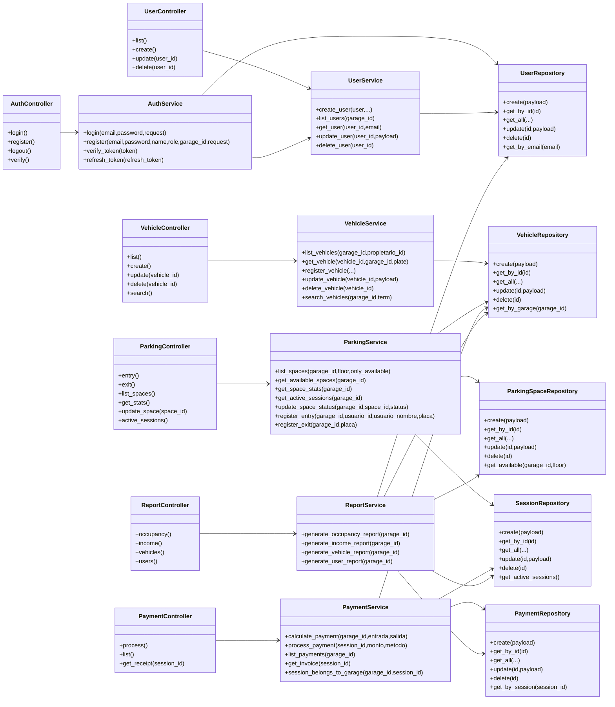

# Diagrama UML de Clases - SmartPark

```mermaid
classDiagram
direction LR

class AuthController {
  +login()
  +register()
  +logout()
  +verify()
}

class UserController {
  +list()
  +create()
  +update(user_id)
  +delete(user_id)
}

class VehicleController {
  +list()
  +create()
  +update(vehicle_id)
  +delete(vehicle_id)
  +search()
}

class ParkingController {
  +entry()
  +exit()
  +list_spaces()
  +get_stats()
  +update_space(space_id)
  +active_sessions()
}

class PaymentController {
  +process()
  +list()
  +get_receipt(session_id)
}

class ReportController {
  +occupancy()
  +income()
  +vehicles()
  +users()
}

class AuthService {
  +login(email,password,request)
  +register(email,password,name,role,garage_id,request)
  +verify_token(token)
  +refresh_token(refresh_token)
}

class UserService {
  +create_user(user,...)
  +list_users(garage_id)
  +get_user(user_id,email)
  +update_user(user_id,payload)
  +delete_user(user_id)
}

class VehicleService {
  +list_vehicles(garage_id,propietario_id)
  +get_vehicle(vehicle_id,garage_id,plate)
  +register_vehicle(...)
  +update_vehicle(vehicle_id,payload)
  +delete_vehicle(vehicle_id)
  +search_vehicles(garage_id,term)
}

class ParkingService {
  +list_spaces(garage_id,floor,only_available)
  +get_available_spaces(garage_id)
  +get_space_stats(garage_id)
  +get_active_sessions(garage_id)
  +update_space_status(garage_id,space_id,status)
  +register_entry(garage_id,usuario_id,usuario_nombre,placa)
  +register_exit(garage_id,placa)
}

class PaymentService {
  +calculate_payment(garage_id,entrada,salida)
  +process_payment(session_id,monto,metodo)
  +list_payments(garage_id)
  +get_invoice(session_id)
  +session_belongs_to_garage(garage_id,session_id)
}

class ReportService {
  +generate_occupancy_report(garage_id)
  +generate_income_report(garage_id)
  +generate_vehicle_report(garage_id)
  +generate_user_report(garage_id)
}

class UserRepository {
  +create(payload)
  +get_by_id(id)
  +get_all(...)
  +update(id,payload)
  +delete(id)
  +get_by_email(email)
}

class VehicleRepository {
  +create(payload)
  +get_by_id(id)
  +get_all(...)
  +update(id,payload)
  +delete(id)
  +get_by_garage(garage_id)
}

class ParkingSpaceRepository {
  +create(payload)
  +get_by_id(id)
  +get_all(...)
  +update(id,payload)
  +delete(id)
  +get_available(garage_id,floor)
}

class PaymentRepository {
  +create(payload)
  +get_by_id(id)
  +get_all(...)
  +update(id,payload)
  +delete(id)
  +get_by_session(session_id)
}

class SessionRepository {
  +create(payload)
  +get_by_id(id)
  +get_all(...)
  +update(id,payload)
  +delete(id)
  +get_active_sessions()
}

AuthController --> AuthService
UserController --> UserService
VehicleController --> VehicleService
ParkingController --> ParkingService
PaymentController --> PaymentService
ReportController --> ReportService

AuthService --> UserService
AuthService --> UserRepository
UserService --> UserRepository
VehicleService --> VehicleRepository
ParkingService --> VehicleRepository
ParkingService --> ParkingSpaceRepository
ParkingService --> SessionRepository
PaymentService --> PaymentRepository
PaymentService --> SessionRepository
PaymentService --> VehicleRepository
ReportService --> UserRepository
ReportService --> VehicleRepository
ReportService --> ParkingSpaceRepository
ReportService --> SessionRepository
ReportService --> PaymentRepository
```
